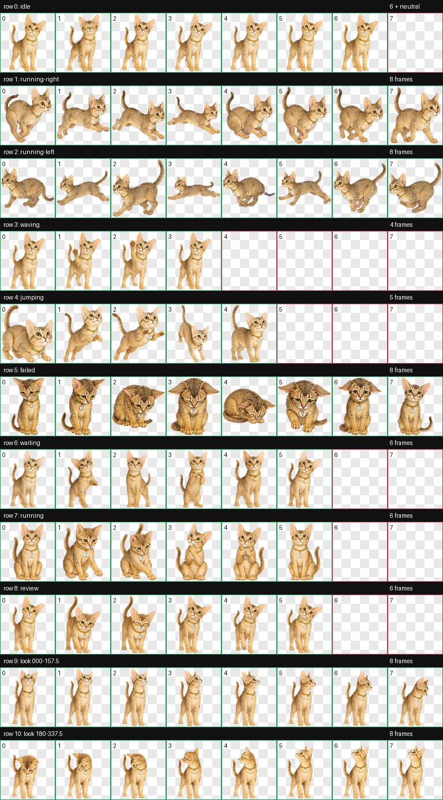
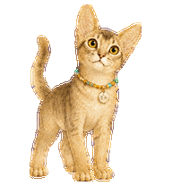
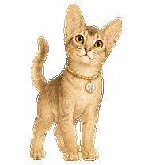
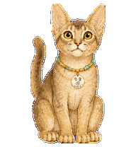
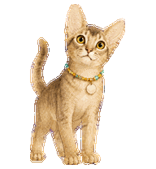
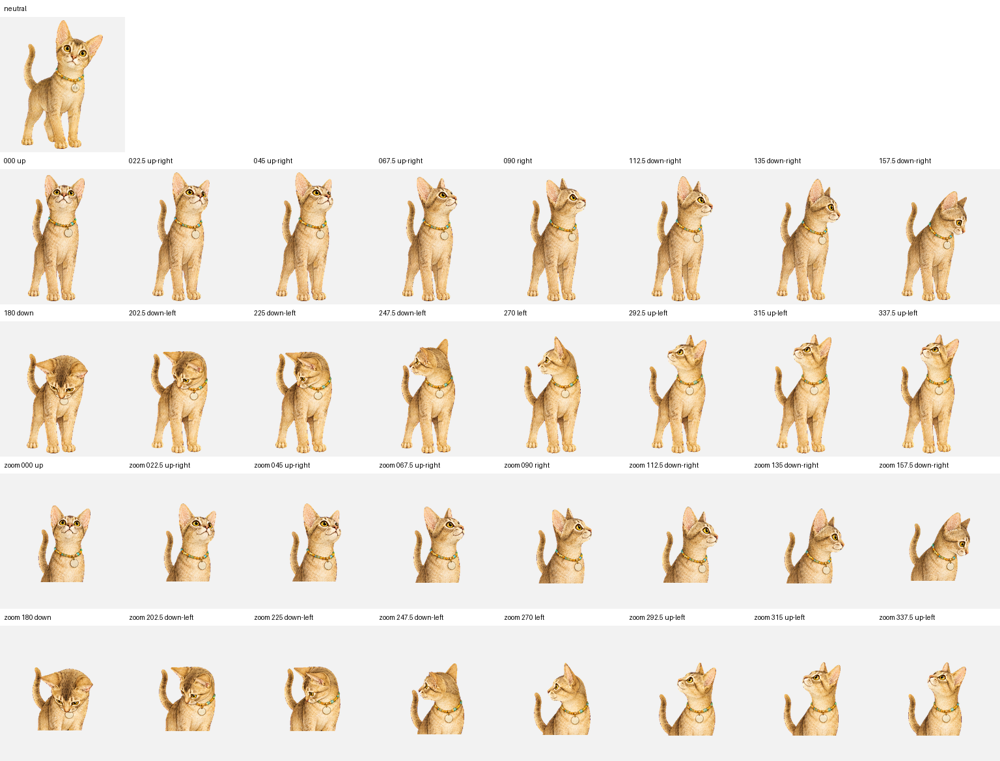

<p align="center">
  <a href="README.md">English</a> · <strong>中文</strong>
</p>

<h1 align="center">小布鲁 · Codex 宠物</h1>

<p align="center">
  <strong>陪你一起工作的好奇阿比西尼亚猫</strong><br>
  暖棕色短毛、明亮大眼睛、串珠项圈，以及完整的 v2 动画动作。
</p>

<p align="center">
  
  
  
  
  
</p>

<p align="center">
  <a href="#项目简介">项目简介</a> ·
  <a href="#效果展示">效果展示</a> ·
  <a href="#技术规格">技术规格</a> ·
  <a href="#安装方法">安装方法</a> ·
  <a href="#仓库结构">仓库结构</a> ·
  <a href="#使用与授权">使用与授权</a>
</p>

> [!IMPORTANT]
> 本仓库只包含可发布的 Codex 宠物成品。猫咪原始照片、私有身份参考、生成提示词、工作文件和淘汰稿均未上传。

## 项目简介

小布鲁的英文名是 **BIUE**。它是一只蓝色阿比西尼亚猫；阿比西尼亚猫的蓝色属于稀释色，视觉上呈现独特的暖棕灰色。它有大而直立的耳朵、琥珀色眼睛、青绿金黄串珠项圈，以及圆形名字牌。宠物包遵循 Codex v2 精灵图规范，包含全部标准任务状态和连续的 16 方向环视动画。

| 目标 | 实现方式 | 效果 |
| --- | --- | --- |
| 保持角色一致性 | 在所有动作中固定脸型、毛色、比例、项圈和名字牌 | 每个状态都能认出是小布鲁 |
| 表达 Codex 工作状态 | 分离待机、移动、招手、跳跃、失败、等待、执行和审查动作 | 宠物会自然响应任务状态变化 |
| 支持指针方向感知 | 以 22.5° 为步长提供 16 个顺时针注视方向 | 视线可以围绕宠物平滑移动 |
| 提供干净发布包 | 透明 WebP、v2 清单、动作预览和确定性验证 | 仓库精简、可检查、可直接本地安装 |

## 效果展示

### 完整动画图集

<p align="center">
  
</p>

### 工作状态

| 待机 | 打招呼 | 执行任务 | 等待输入 |
| --- | --- | --- | --- |
|  |  |  |  |

### 环视方向

<p align="center">
  
</p>

[`previews`](previews/) 目录还包含左右移动、跳跃、失败和审查等动作 GIF。

## 技术规格

| 项目 | 数值 |
| --- | --- |
| 精灵图规范 | Codex Pet v2 |
| 图集文件 | `spritesheet.webp` |
| 图集尺寸 | 1536 × 2288 px |
| 网格 | 8 列 × 11 行 |
| 单帧尺寸 | 192 × 208 px |
| 标准状态 | 9 种 |
| 环视方向 | 16 个，以 22.5° 为步长顺时针排列 |
| 透明格式 | RGBA WebP |
| 清单文件 | `pet.json`，包含 `spriteVersionNumber: 2` |
| 验证结果 | 0 个错误、0 个警告 |

> [!NOTE]
> 这是桌面端/CLI 使用的 v2 宠物包。ChatGPT 网页版自定义宠物采用不同的 1536 × 1872 素材规范，因此不能把本仓库的 `spritesheet.webp` 原样上传到网页选择器。

## 安装方法

### 1. 克隆仓库

```bash
git clone https://github.com/rudykon/codex-pet-blue.git
cd codex-pet-blue
```

### 2. 安装宠物

#### Windows PowerShell

```powershell
$petDir = "$env:USERPROFILE\.codex\pets\xiaobulu"
New-Item -ItemType Directory -Force -Path $petDir | Out-Null
Copy-Item .\pet.json, .\spritesheet.webp -Destination $petDir
```

#### macOS / Linux

```bash
mkdir -p ~/.codex/pets/xiaobulu
cp pet.json spritesheet.webp ~/.codex/pets/xiaobulu/
```

### 3. 选择小布鲁

刷新或重启 Codex，然后在宠物选择器中选择 **小布鲁**。在 Codex CLI 中，可以使用 `/pets` 查看和切换本地宠物。

## 仓库结构

| 路径 | 用途 |
| --- | --- |
| [`pet.json`](pet.json) | 宠物 ID、显示名称、简介、精灵图版本和图集路径 |
| [`spritesheet.webp`](spritesheet.webp) | 完整透明 v2 动画图集 |
| [`previews/contact-sheet.png`](previews/contact-sheet.png) | 全部动画行的视觉总览 |
| [`previews/look-directions.png`](previews/look-directions.png) | 中立姿势和 16 方向注视循环 |
| [`previews/`](previews/) | 各状态的动画 GIF 预览 |
| [`validation.json`](validation.json) | 机器可读的图集验证结果 |

## 隐私与负责任分享

- 仓库不包含猫咪原始照片、EXIF 元数据、私有身份参考或个人文件。
- 发布包只保留经过确认的成品美术、预览、元数据和验证结果。
- 第三方转载应保留角色来源，不得暗示该宠物获得 OpenAI 官方背书。
- Codex 宠物规范可能继续变化；若平台当前行为与本文冲突，以平台为准。

## 使用与授权

本仓库用于个人 Codex 安装和非商业展示。小布鲁角色设计及美术素材**保留所有权利**。未经创作者明确许可，请勿销售、再授权、作为竞争性宠物包重新分发、用于训练数据，或冒充原创作品发布。

Codex、ChatGPT 和 OpenAI 是 OpenAI 的商标。本社区宠物并非 OpenAI 官方产品，也不代表官方认可或背书。
